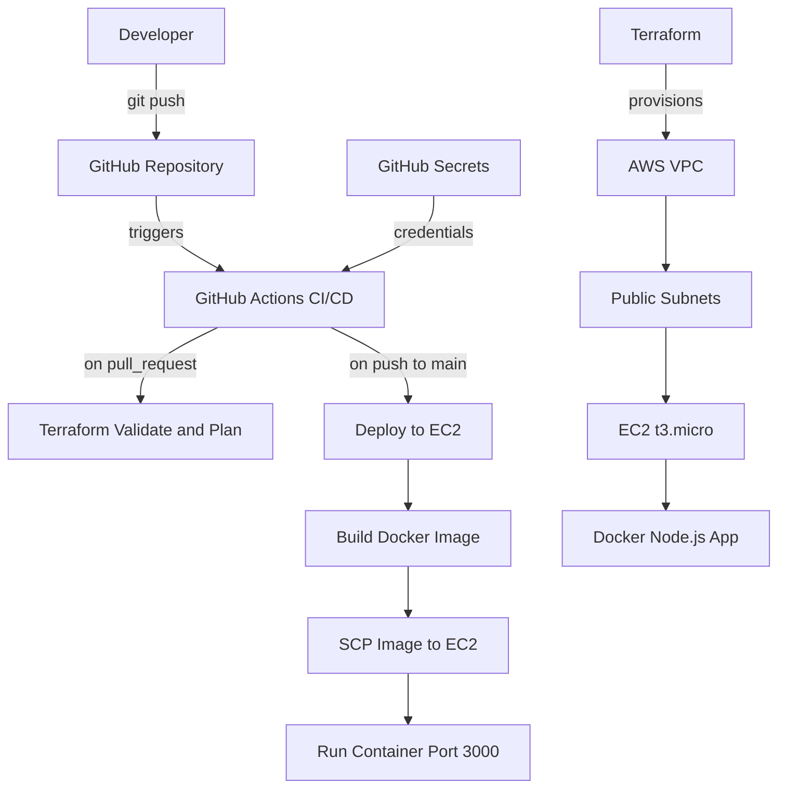

# Terraform + CI/CD Automation

Automated AWS infrastructure provisioning with Terraform and CI/CD pipeline using GitHub Actions and Docker.

## Architecture



## Tech Stack
| Tool | Purpose |
|------|---------|
| Terraform | Infrastructure as Code |
| AWS VPC | Isolated network |
| AWS EC2 | App server |
| Docker | Containerization |
| GitHub Actions | CI/CD pipeline |
| Node.js + Express | Application |

## Setup
### 1. Provision Infrastructure
```bash
cd terraform
terraform init
terraform apply
```

### 2. GitHub Secrets Required
| Secret | Description |
|--------|-------------|
| EC2_HOST | EC2 public IP |
| EC2_SSH_KEY | Private SSH key |
| EC2_PUBLIC_KEY | Public SSH key |
| AWS_ACCESS_KEY_ID | AWS credentials |
| AWS_SECRET_ACCESS_KEY | AWS credentials |

### 3. Deploy
Push to main - pipeline auto-deploys Docker container to EC2.

### 4. Rollback
```bash
./rollback.sh <commit-sha>
```

## CI/CD Workflows
- deploy.yml - push to main, builds and deploys Docker image
- terraform.yml - pull request, validates and plans Terraform

## Infrastructure
| Resource | Config |
|----------|--------|
| VPC | 10.0.0.0/16 |
| Subnet 1 | 10.0.1.0/24 us-east-1a |
| Subnet 2 | 10.0.2.0/24 us-east-1b |
| EC2 | t3.micro Amazon Linux 2 |
| App Port | 3000 |
